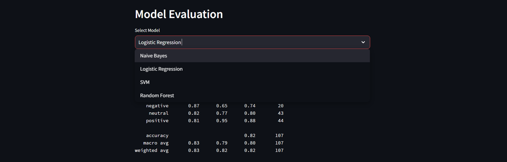
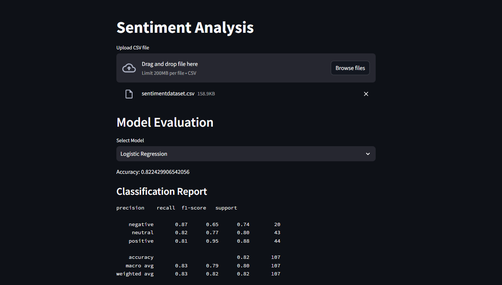
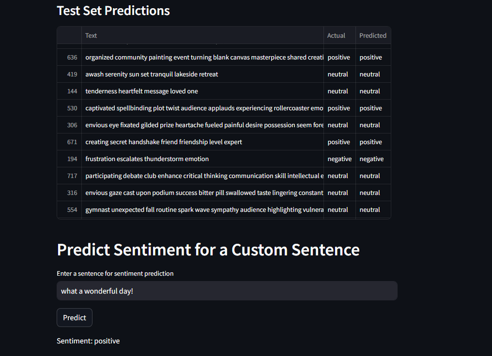

# Sentiment Analysis


## Table of Contents

- [Introduction](#introduction)
- [Features](#features)
- [Concepts Demonstrated](#concepts-demonstrated)
- [Class Descriptions](#class-descriptions)
- [Usage](#usage)
- [Installation](#installation)

## Introduction

Welcome to the Sentiment Analysis project! This project was developed to demonstrate text processing and classification techniques using machine learning. It aims to classify the sentiment of text data as positive, negative, or neutral.

## Features

- Text data preprocessing and cleaning
- Sentiment classification using multiple machine learning models
- Hyperparameter tuning for model optimization
- Ensemble learning for improved accuracy
- Interactive user interface for sentiment prediction

## Concepts Demonstrated

This project demonstrates the following concepts:

- **Text Preprocessing**: Techniques to clean and prepare text data for analysis.
- **Feature Extraction**: Transforming text data into numerical features using TF-IDF.
- **Model Training and Evaluation**: Training multiple machine learning models and evaluating their performance.
- **Hyperparameter Tuning**: Using GridSearchCV for finding the best model parameters.
- **Ensemble Learning**: Combining multiple models to improve prediction accuracy.
- **Streamlit**: Creating an interactive user interface for model predictions.

## Class Descriptions

### Text Processing and Vectorization

- **TextPreprocessor**: Contains methods for cleaning and preprocessing text data, including removing HTML tags, expanding contractions, and lemmatizing words.
- **TfidfVectorizer**: Converts text data into TF-IDF features for model training.

### Machine Learning Models

- **NaiveBayesModel**: Implements the Multinomial Naive Bayes classifier.
- **LogisticRegressionModel**: Implements logistic regression with hyperparameter tuning.
- **SVMModel**: Implements Support Vector Machine with hyperparameter tuning.
- **RandomForestModel**: Implements Random Forest classifier with hyperparameter tuning.
- **EnsembleModel**: Combines multiple models using a voting classifier.

## Usage

To use the Sentiment Analysis system, follow these steps:

1. Clone the repository.
2. Install the required packages.
3. Run the Streamlit application to interact with the system.

## Installation

1. Clone the repository:
    ```bash
    git clone https://github.com/Abraam318/sentiment-analysis.git
    ```
2. Navigate to the project directory:
    ```bash
    cd sentiment-analysis
    ```
3. Install the required packages:
    ```bash
    pip install -r requirements.txt
    ```
4. Run the Streamlit application:
    ```bash
    streamlit run app.py
    ```

## Additional Resources

### Project Images





*Description: The main interface of the Sentiment Analysis application where users can upload data and select models for sentiment prediction.*

### Dataset

Download the dataset used for this project: 
[dataset.csv](path_to_dataset.csv)

*Description: The CSV file containing the text data and sentiment labels used for training and evaluating the models.*

We welcome contributions! Please fork the repository and submit a pull request.
